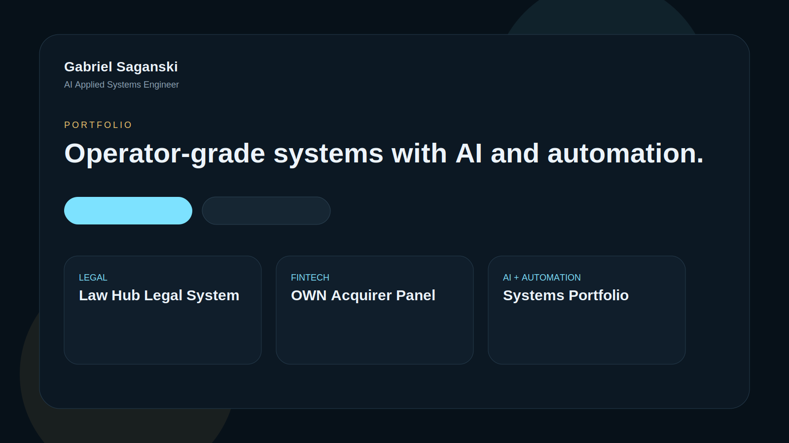

# gabrielrmsaganski-cpu.github.io

This repository contains the static GitHub Pages portfolio site for the curated engineering portfolio. It is intentionally dependency-free so it can be pushed and hosted directly by GitHub Pages without a build pipeline.

## Overview

The site presents:

- a high-end engineering hero section
- featured project cards
- system architecture narrative
- technology stack summary
- contact links for GitHub and LinkedIn

## Structure

- `index.html`: portfolio page markup
- `styles.css`: visual system, animations, layout, responsive behavior
- `app.js`: project rendering and UI interactions
- `assets/data/projects.json`: project catalog

## Screenshots

## Deployment

Push to the `gabrielrmsaganski-cpu.github.io` repository and enable GitHub Pages from the default branch root.
